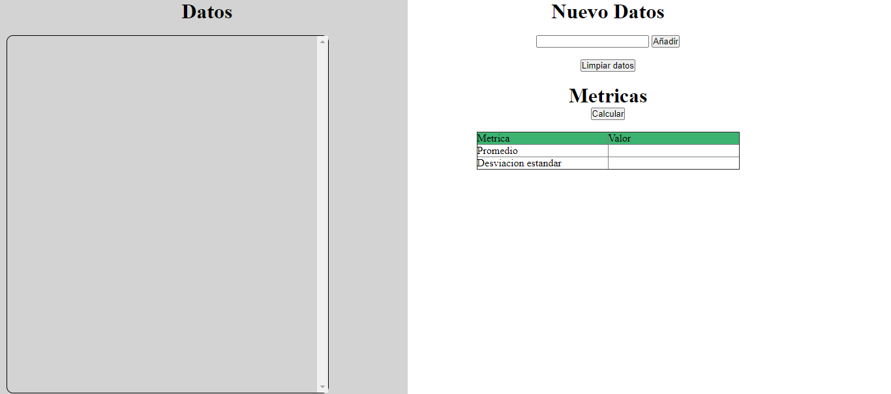

## Tarea Spark
### presentado por:
Jeisson G. Sanchez R.

### Entrega anterior

[ver](https://github.com/JaySanchez0/AREP-TALLER-01)

### Componenetes

- Vista (HTML)
- Cliente JavaScript
- Api calcular(obtiene la media y la desviacion estandar).
- Modelo datos anterior

### Aplicacion

Podemos escribir datos y estos se mostraran en el costado izquierdo.

Al darle en el boton calcular enviamos un post con el arreglo de los datos para obtener las medidas de la muestra y estas son mostradas en la tabla que se encuentra debajo del boton calcular.

Al presionar el boton limpiar se borran los datos tanto de la tabla de resultados como del costado izquierdo donde se mostraban los datos añadidos.

### Documento Arquitectura

[ver](AREP_T_02.pdf)
 

### Heroku

[ver](https://mysterious-scrubland-92084.herokuapp.com/)

### Referencias

- [documentacion spark](http://sparkjava.com/documentation)

- [stackoverflow servir archivos estaticos](https://stackoverflow.com/questions/60085799/how-to-serve-static-content-for-sparkjava-running-on-tomcat-as-filter)